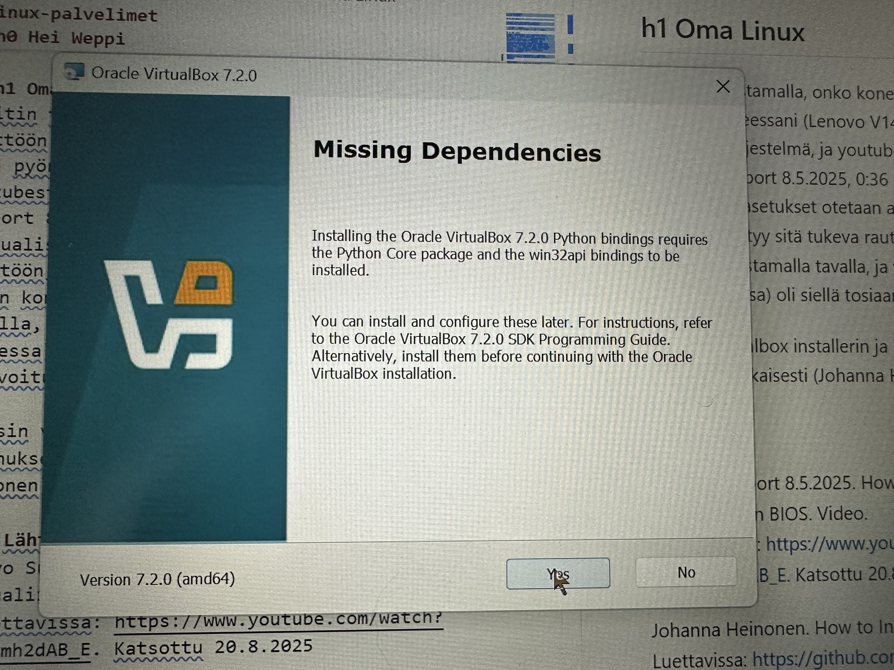

# linux-palvelimet
Kurssin raportit

## h0 Hei Weppi

Perustin uuden repositorion githubiin ja harjoittelin markdownin kirjoittamista.
  
  let nimi = "Miika";
  console.log("Hei kaikki, mä olen " + nimi);

## h1 Oma Linux
Aloitin tarkastamalla, onko koneessani otettu käyttöön VT-X. Omassa koneessani (Lenovo V14 G4 AMN) pyörii Windows 11 Pro käyttöjärjestelmä, ja youtubesta löytämästäni tutorialista (Lenovo Support 8.5.2025, 0:36 min) selvisi, että virtualisointiasetukset otetaan automaattisesti käyttöön, jos koneesta löytyy sitä tukeva rauta.
Menin koneen bios-asetuksiin videon ohjeistamalla tavalla, ja virtualisointi (nimetty AMD-V tässä koneessa) oli siellä tosiaan jo valmiiksi aktivoitu käyttöön.

Latasin virtualbox installerin ja käynnistin asennuksen kurssin ohjeiden mukaisesti (Johanna Heinonen). Asennuksen yhteydessä tuli ilmoitus puuttuvista riippuvuuksista: Installing the Oracle VirtualBox 7.2.0 Python bindings requires the Python Core package and the win32api bindings to be installed. Ilmoituksessa luki myös, että tämän voi asentaa myös jälkikäteen, joten päätin viedä asennuksen maaliin ilman sitä. Virtualboxin ohjelmointimanuaalissa (Oracle VirtualBox Programming Guide and Reference) luki, että riippuvuutta tarvitaan jos VirtualBoxia haluaa scriptata Pythonilla. Päätin jättää sen asentamatta ja palata asiaan, jos sille on tarvetta myöhemmin kurssilla.

Seuraavaksi latasin ja asensin Debianin 

#### Lähteet
Lenovo Support 8.5.2025. How To Enable Virtualization Technology In BIOS. Video.  
Katsottavissa: https://www.youtube.com/watch?v=FLymh2dAB_E. Katsottu 20.8.2025

Johanna Heinonen. How to Insall Linux to Virtualbox?  
Luettavissa: https://github.com/johannaheinonen/johanna-test-repo/blob/main/linux-20082025.md. Luettu: 21.8.2025

Tero Karvinen. Install Debian on Virualbox - Updated 2024.  
Luettavissa: https://terokarvinen.com/2021/install-debian-on-virtualbox/. Luettu: 21.8.2025

Oracle VirtualBox Programming Guide and Reference.  
Luettavissa: https://download.virtualbox.org/virtualbox/SDKRef.pdf. Luettu: 21.8.2025