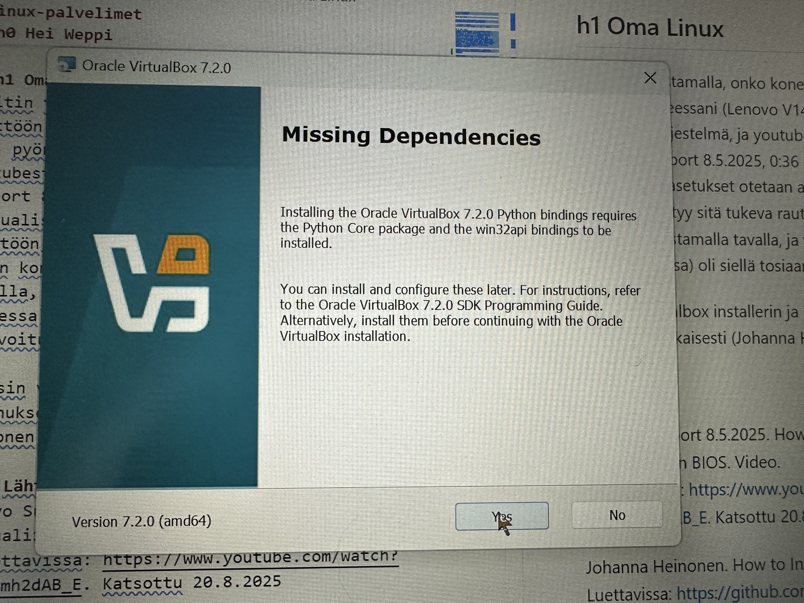
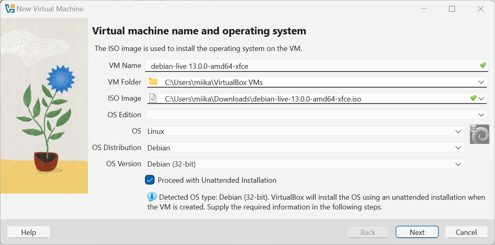
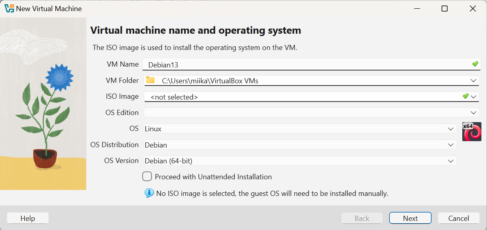
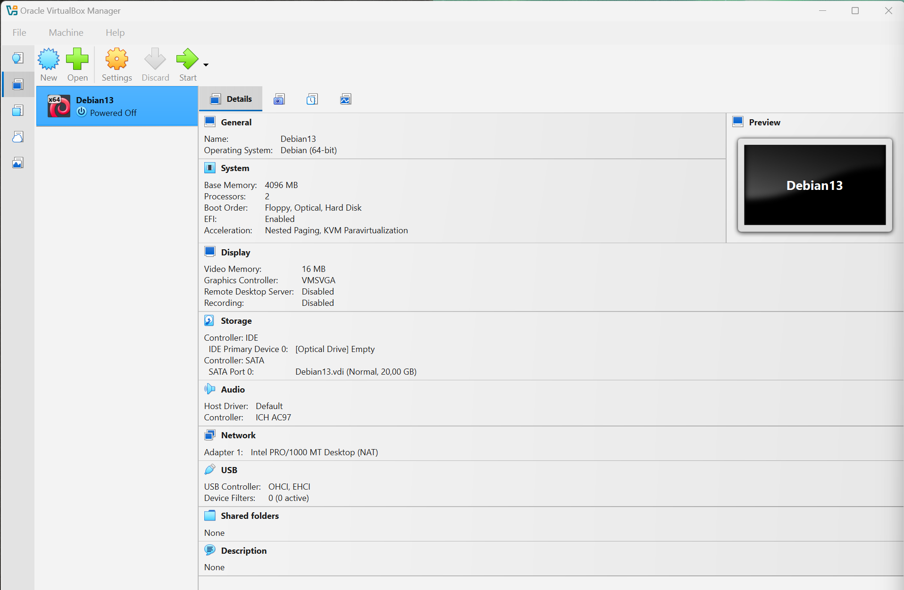
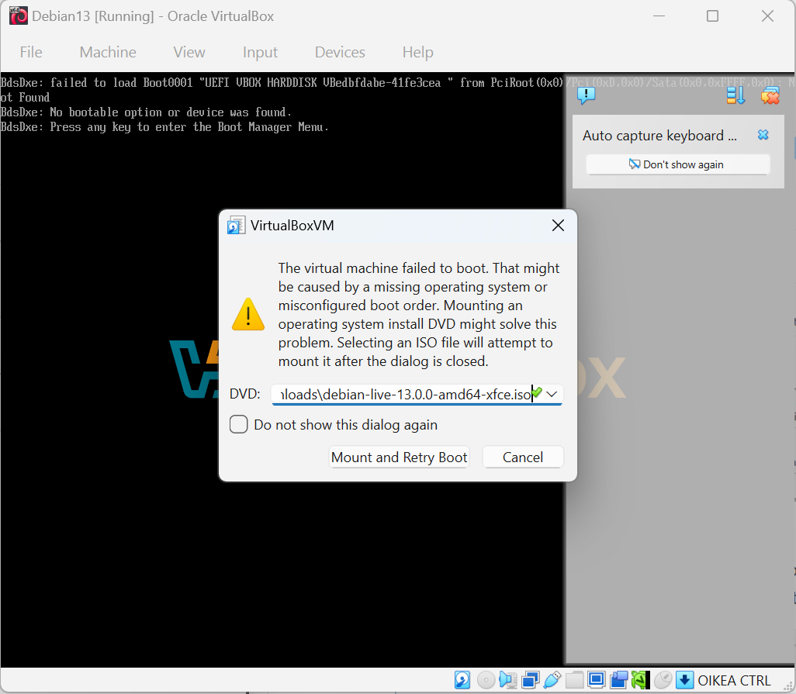
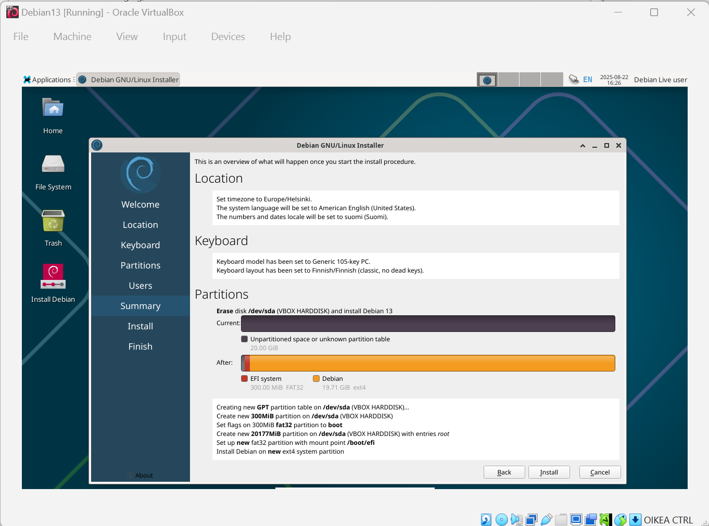

## h1 Oma Linux

### Raportin kirjoittaminen
Kirjoitan tätä sen jälkeen, kun sain varsinaisen kotitehtävän tehtyä.  
Tällä kurssilla raportointiohjeet ovat huomattavasti kovemmat kun mitä aikasemmilla kursseilla on ollut. Työelämässä olen ulkoistanut raporttien kirjoittamisen ja dokumentaation laatimisen kokonaan tekoälylle, koska nämä ovat mielestäni melko ikäviä ja pitkäveteisiä prosesseja. Ymmärrän toisaalta hyvin, miksi oppimistilanteessa kannustetaan kirjoittamiseen, koska se auttaa selkeyttämään omia ajatuksia ja samalla edesauttaa luovaa ajattelua ja ongelmanratkaisua.

Pyrin täsmällisyyteen ja helppolukuisuuteen, mutta palautetta saa toki antaa.

En valitettavasti muistanut ottaa kellonaikoja ylös tehtävää tehdessäni, joten pahoittelut siitä etukäteen.

### Virtualisointiasetukset
Tein harjoituksen 21.8-22.8.2025 kotitoimistossani. Koneena oli Lenovo V14 G4 AMN.

Aloitin tarkastamalla, onko koneessani otettu käyttöön VT-X. Omassa koneessani pyörii Windows 11 Pro käyttöjärjestelmä, ja youtubesta löytämästäni tutorialista (Lenovo Support 8.5.2025, 0:36 min) selvisi, että virtualisointiasetukset otetaan automaattisesti käyttöön, jos koneesta löytyy sitä tukeva rauta.
Menin koneen bios-asetuksiin videon ohjeistamalla tavalla, ja virtualisointi (nimetty AMD-V tässä koneessa) oli siellä tosiaan jo valmiiksi aktivoitu käyttöön.

### Virtual Boxin asentaminen

Latasin virtualbox installerin ja käynnistin asennuksen kurssin ohjeiden mukaisesti (Johanna Heinonen). Asennuksen yhteydessä tuli ilmoitus puuttuvista riippuvuuksista: Installing the Oracle VirtualBox 7.2.0 Python bindings requires the Python Core package and the win32api bindings to be installed. Ilmoituksessa luki myös, että tämän voi asentaa myös jälkikäteen, joten päätin viedä asennuksen maaliin ilman sitä. Virtualboxin ohjelmointimanuaalissa (Oracle VirtualBox Programming Guide and Reference) luki, että riippuvuutta tarvitaan jos VirtualBoxia haluaa scriptata Pythonilla. Päätin jättää sen asentamatta ja palata asiaan, jos sille on tarvetta myöhemmin kurssilla.

### Debianin asennus
Seuraavaksi latasin ja asensin Debianin ja aloin asentamaan sitä VirtualBoxin avulla. Tässä kohtaa alkoi tulla vastaan ongelmia. Kun valitsin ISO-imageksi lataamani asennustiedoston, niin Debianin versio muuttui automaattiseksi 32-bittiseksi, ja sitä ei ollut mahdollista vaihtaa takaisin 64-bittiseksi.

 Selvittelin asiaa ChatGPT:n avustuksella ja tämä pyysi tarkistamaan seuraavat asiat:

  - Tarkista, että prosessorin virtualisointi on sallittu BIOS-asetuksista.
  - Käytätkö toista virtualisointiohjelmaa samaan aikaan, esim. Hyper-V?
  
Tiesin jo, että virtualisointi on sallittu asetuksissa, joten koitin ajaa terminaalissa komennon: bcdedit /set hypervisorlaunchtype off, jonka pitäisi poistaa Windowsin hypervisori käytöstä ja vapauttaa AMD-V VirtualBoxille.
Koitin jopa (tekoälyn rohkaisemana) ottaa pois päältä Virtualization-based securityn koneen turvallisuusasetuksista, mutta tämäkään ei auttanut.

Lopulta huomasin, että jos Virtuaalista konetta luodessani en laita ISO-kuvaan mitään, niin järjestelmä tunnistaa Debianin automaattisesti 64-bittiseksi, joten kokeilin sitä.

Nyt sain Virtuaalisen koneen luotua.

Kun käynnistin koneen ensimmäisen kerran, niin se herjasi, että levyasemassa ei ole mitään, mutta tässä kohtaa sain lisättyä ISO-tiedoston ongelmitta ja sain homman pelittämään. En vieläkään ymmärrä miksi Virtualbox yritti pakkottaa 32-bittistä asennusta, mutta ehkä se selviää jossain vaiheessa.

Ensi töikseni avasin selaimen ja testasin että internet-yhteys toimii. Lisäksi vaihdoin näppäimistön suomalaiseen versioon setxkbmap fi -komennolla. Tässä vaiheessa siirryin kurssin toiseen materiaaliin (Tero Karvinen) ja aloin seuraamaan sitä.

Käynnistin työpöydältä Calamares installerin. Valitsin järjestelmän kielen, aikavyöhykkeen sekä näppäimistön. Select Storage device- kohdassa ei ollut valittavana ohjeen mukaista (dev/vda), joten valitsin ainoana vaihtoehtona olevan 20.00 GiB (/dev/sda). Lopuksi asetin nimen, käyttäjänimen, koneen nimen ja salasanan ja aloitin asennuksen.

### Viimeistelyä ja järjestelmän päivitystä
Asennuksen jälkeen kone boottasi itsensä jonka jälkeen kirjauduin sisään. Jatkoin Teron ohjeiden seuraamista ja asensin palomuurin komennolla sudo apt-get -y install ufw ja päivitin koko järjestelmän sudo apt-get -y dist-upgrade -komennolla, jonka jälkeen boottasin jälleen koneen. Koitin vielä asentaa joitain Teron suosittelemia ohjelmia, mutta firefoxin ad blockeria ei löytynyt.

Lopulta avasin vielä selaimen ja testasin että nettiyhteydet, hiiri ja näppis toimivat normaalisti, jonka jälkeen homma oli paketissa.

#### Lähteet
Lenovo Support 8.5.2025. How To Enable Virtualization Technology In BIOS. Video.  
Katsottavissa: https://www.youtube.com/watch?v=FLymh2dAB_E. Katsottu 20.8.2025

Johanna Heinonen. How to Insall Linux to Virtualbox?  
Luettavissa: https://github.com/johannaheinonen/johanna-test-repo/blob/main/linux-20082025.md. Luettu: 21.8.2025

Tero Karvinen. Install Debian on Virt-Manager - Trixie update 2025.  
Luettavissa: https://terokarvinen.com/2021/install-debian-on-virtualbox/. Luettu: 21.8.2025

Oracle VirtualBox Programming Guide and Reference.  
Luettavissa: https://download.virtualbox.org/virtualbox/SDKRef.pdf. Luettu: 21.8.2025