# Komentaja Pingviini

### Lue ja tiivistä 
- Linuxin komentorivi vaikuttaa tehokkaalta työkalulta, kun komennot tulevat ulkomuistista ja niiden toiminnan ymmärtää syvällisesti.
- Artikkeli on hyvä yleisen tason perehdytys Linuxin komentorivin perusteista. Tästä on näppärä käydä lunttaamassa kun tutustuu ja hrajoittelee käyttöjärjestelmän kanssa ensimmäistä kertaa.
- Pidän siitä, miten komentojen yhdistelemisestä ja putkittamisesta annetaan konkreettisia esimerkkejä.

### Ympäristö
Tein harjoituksen 28 ja 31.8.2025 kotitoimistossani. Koneena oli Lenovo V14 G4 AMN.

### Asenna micro-editori
28.8.2025 17:40   
Aloitin päivittämällä pakettilistan komennolla __sudo apt-get update__. Seuraavaksi hain micro-editoria __apt-cache search micro__-komennolla, mutta lista oli niin jäätävän pitkä että päätin putkittaa edellisen komennon __grep ^micro__-komennolla. Tämä rajasi tuloksia riittävästi, kuten alla olevasta kuvasta näkyy. Komennolla __apt-cache show micro | less__ tutustuin editorin dokumentaatioon. Dokumentaatiosta näki paljon kiinnostavaa tietoa, kuten esim. ohjelman version, ohjelman koon, lyhyen kuvauksen sekä paljon muuta. Dokumentaatiossa suositeltiin myös lataamaan xclip-nimisen ohjelman, joka parantaa micron toiminnallisuutta mahdollistamalla tekstin kopioimisen ja liittämisen terminaalissa (opensourse.com).  

17:52   
Lopuksi asensin sekä micron __sudo apt-get -y install micro__-komennolla. Xclip oli jo valmiiksi asennettuna. Kokeilin vielä että ohjelma aukeaa komennolla __micro fileA.txt__

### Asenna kolme komentoriviohjelmaa
31.8.2025 13:44 
Asensin ohjelmat fuzzy finder, atuin ja btop.
 

fuzzy finder on on ohjelma, jolla voi erittäin nopeasti ja vaivattomasti hakea nykyisestä hakemistosta mitä tahansa tiedostoja, git committeja, komentoja ja paljon muuta (The Linux Experiment 3:18-4:22). Komennolla __fzf -q "tiedoston nimi" -e__, se antaa tuloksia hakemallasi hakusanalla, juuri siinä muodossa kuin sen kirjoitit.
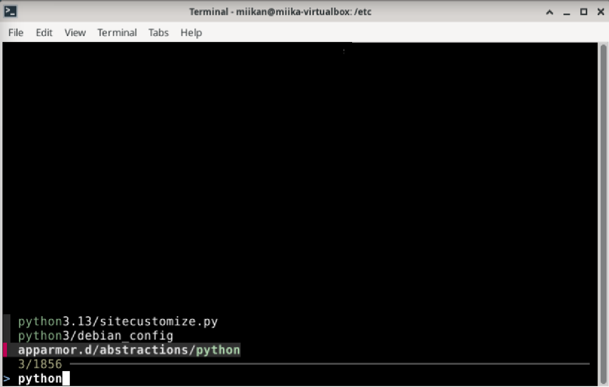
Jos et muista koko tiedoston nimeä, voit kirjoittaa vain osan nimestä ja se löytää tiedoston silti. Voit myös esimerkiksi hakea tiedostoja, joiden nimi loppuu antamallasi hakusanalla, tai hakea tiedostoja jotka eivät sisällä antamaasi hakusanaa.   

Atuin on parempi tapa selata komentohistoriaa kun perinteinen nuoli ylöspäin. Ohjelma tallentaa komennot SQLite tietokantaan. Kun Atuin on asennettu, painamalla nuoli ylöspäin, avautuu komentohistoriasi helpommin nähtävässä muodossa
(The Linux Experiment 4:23-5:24). Voit valita komennon historiasta ja ajaa sen suoraan enterillä, tai editoida sitä tabilla.

Asennuksen jälkeen atuin vaatii vielä käyttöönottoa. Tämä onnistuu komennolla __echo 'eval "$(atuin init bash)"' >> ~/.bashrc__ (docs.atuin.sh). Bashissa atuin vaatii myös joko bash-preexec tai ble.sh asennuksen, jotta komennot tallentuvat realiajassa. Itse valitsin ble.sh, koska sen asennus vaikutti selkeämmältä.     
Toimin seuraavasti:  
- Latasin ble.sh:n komennolla __curl -L https://github.com/akinomyoga/ble.sh/releases/download/nightly/ble-nightly.tar.xz | tar xJf -__
- Asensin sen __bash ble-nightly/ble.sh --install ~/.local/share__
- Aseta ble.sh latautumaan jokaisessa istunnossa __echo 'source -- ~/.local/share/blesh/ble.sh' >> ~/.bashrc__ (tämän komennon on oltava ennen atuin init bash -komentoa .bashrc -tiedostossa). (akinomyoga)

Lopputulos näyttää tältä:

Kolmas ohjelma minkä latasin oli btop. Se näyttää reaaliaikaisesti CPU:n, muistin, swapin, verkon ja levyn käytön. Se myös listaa käynnissä olevat prosessit ja antaa käyttäjälle mahdollisuuden tappaa niitä suoraan ohjelmasta (The Linux Experiment 10:10-10:53). Se on erinomainen työkalu, kun haluat selvittää miksi kone hidastelee tai mikä prosessi vie kaiken muistin/CPU:n.

### Esittele Kansiot
18:15
- /: Linuxin juurihakemisto. Tämä on korkeimman tason hakemisto, joka sisältää kaikki koneen muut hakemistot. Yksi sen sisältämistä kansioista on /root, joka on järjestelmän pääkäyttäjän (superuser) kotihakemisto. Pääkäyttäjällä on täydet admin-oikeudet järjestelmään, joten jos haluat muokata tai tallentaa scriptejä tai asetuksia /root:iin, vaatii se sudo -komentoa ja salasanaa.
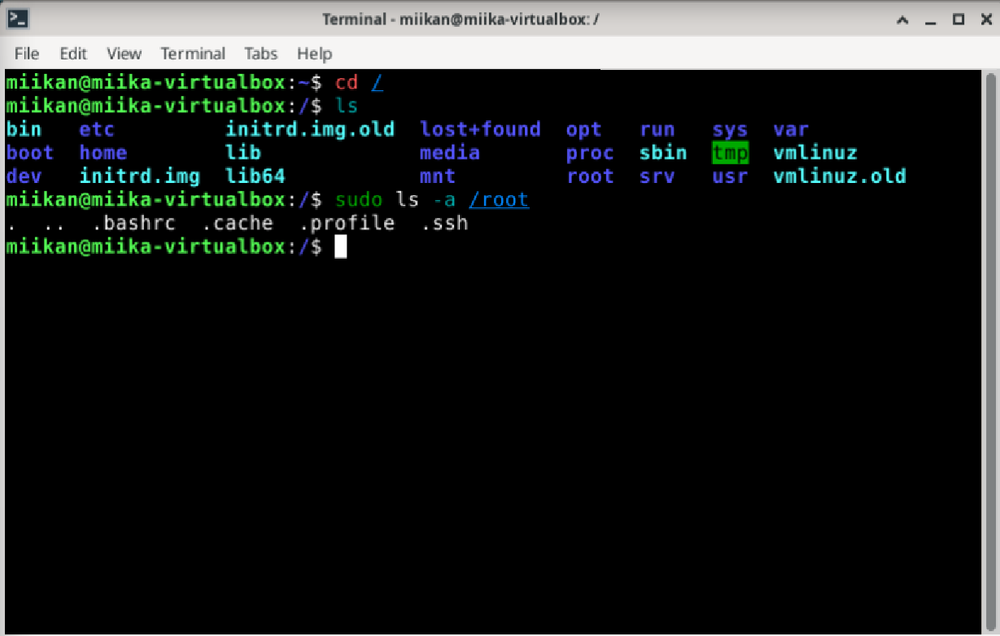

- /home/: Tämä sisältää kaikkien tavallisten käyttäjien hakemistot (tällä virtuaalikoneella ainoastaan oman kotihakemistoni).
- /home/miikan/: Oma kotihakemistoni. Tähän kansioon käyttäjällä on täysi kirjoitusoikeus. Siellä säilytetään esimerkiksi kaikkia henkilökohtaisia konfiguraatiotiedostoja.
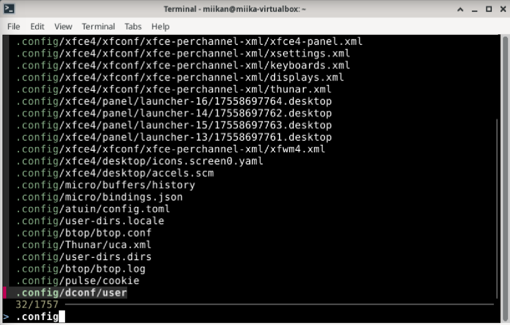
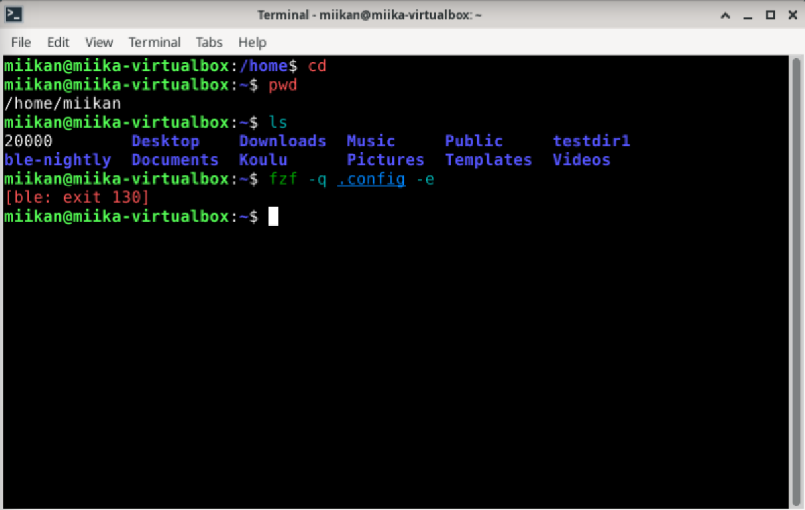

-/etc/: Tämä sisältää koko järjestelmän laajuiset asetukset. Yksi esimerkki näistä on ssh (Secure Shell), protokolla, joka salaa etäyhteyden koneelta toiselle.
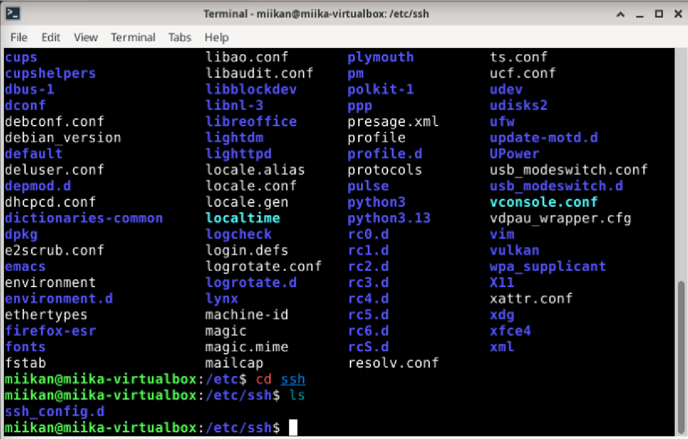

-/media/: media kansio on tarkoitettu kaikelle irroitettavalle medialle (esim. usb-tikut ja cd-levyt). Tämä kansio on minulla tyhjä.
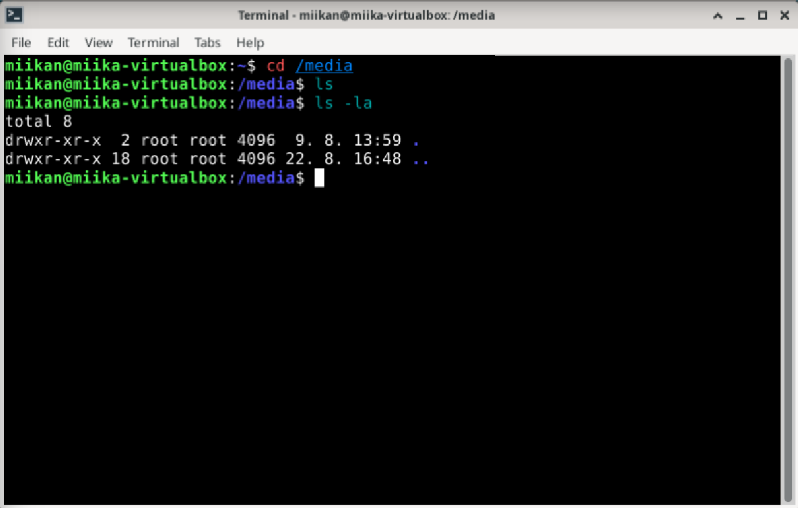

-/var/log: Tämä sisältää kaikki järjestelmän lokitiedot. Jos esimerkiksi jokin ohjelma ei toimi, syyvä voi lähteä etsimään näistä lokitiedoista. Esimerkiksi komennolla __sudo journalctl | tail__ käyttäjä näkee kaikki viimeisimmät järjestelmätapahtumat.
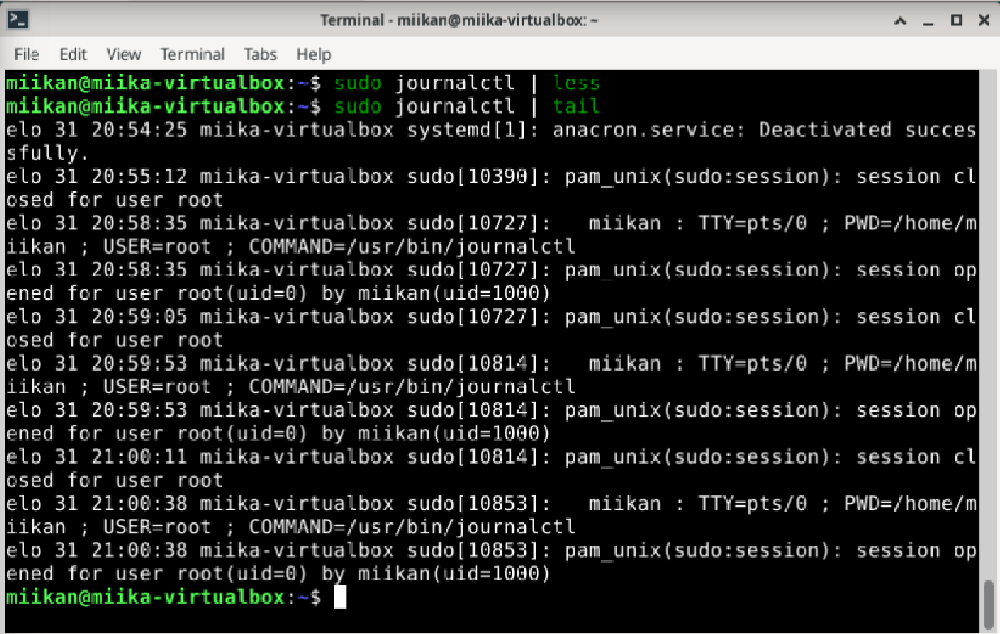

### Grep
20:30
Ensimmäinen esimerkki grepin käytöstä tuli itse asiassa toiselta opiskelijalta, jonka työtä arvioin viime viikolla. Jos sinulla on tiedosto esimerkiksi pitkä lokitiedosto, ja haluat etsit tiettyä sanaa on grep tähän erinomainen työkalu. Komento tulostaa jokaisen rivin jolla kyseinen sana esiintyy.
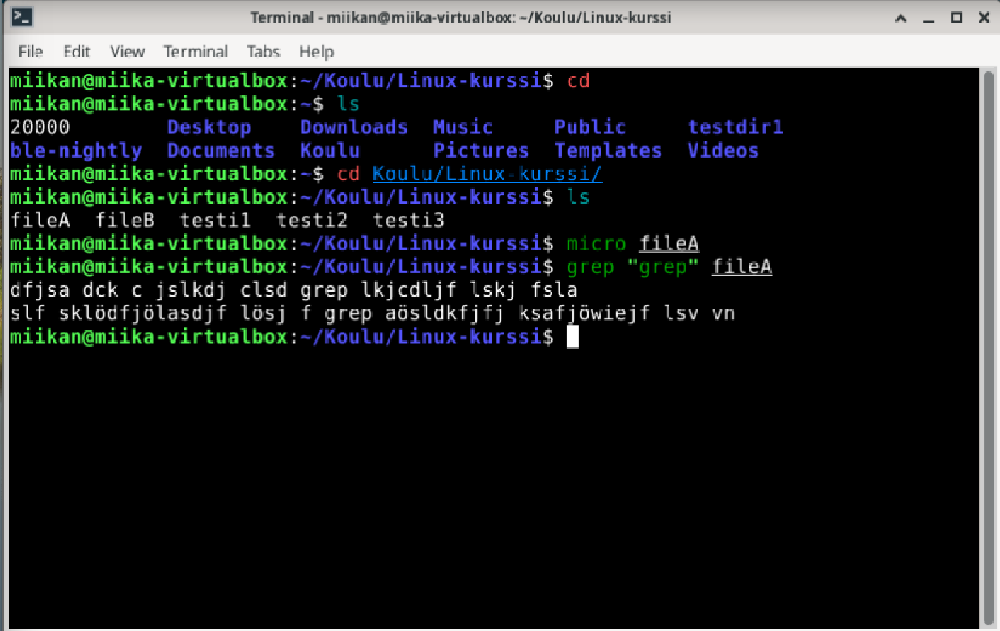
Voit myös hakea mistä hakemiston tiedostoista löytyy osumia. Flagilla -l (pieni L) tulostetaan tiedostojen nimet, ja jos tähän yhdistetään -r, eli rekursiivinen haku (myös alihakemistot) sekä -i (grep ei välitä kirjainkoosta), niin hakuja voi tehdä erittäin tehokkaasti.
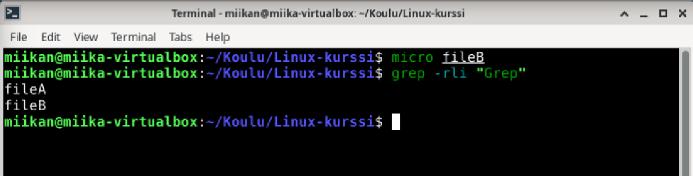

### Pipe
21:00
Jatketaan edellisellä esimerkillä. Jos haluan muokata tiedostoja, jotka sisältävät grepin hakusanan, niin voin putkittaa edellisen komennon __xargs micro__-komennolla. Tämä avaa kaikki löydetyt tiedostot suoraan editoriin muokattavaksi. Tässä pitää toki olla varovainen, sillä jos grep löysi vaikka 100 tiedostoa, niin komento avaa kyselemättä kaikki 100 tiedostoa editoriin.
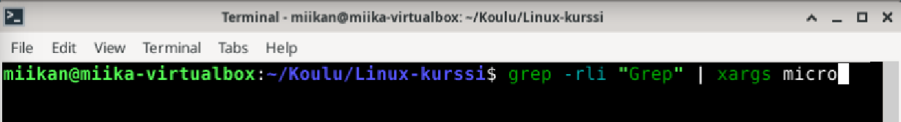
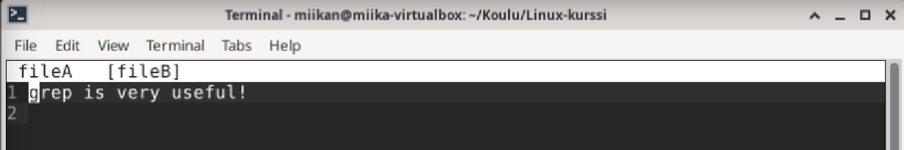

### Lähteet
opensource.com. Copy and paste at the Linux command line with xclip. Luettavissa: https://opensource.com/article/19/7/xclip. Luettu: 28.8.2025.  

The Linux Experiment. 27.2.2024. 12 GREAT command line programs that YOU recommended. Katsottavissa: https://www.youtube.com/watch?v=nCS4BtJ34-o. Katsottu 31.8.2025.

Atuin. Installing the shell plugin. Luettavissa: https://docs.atuin.sh/guide/installation/. Luettu 31.8.2025.

github.com. akinomyoga / ble.sh. Luettavissa: https://github.com/akinomyoga/ble.sh?tab=readme-ov-file#get-from-source. Luettu: 31.8.2025.
