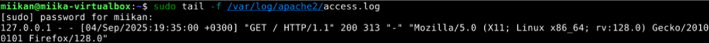

Tein harjoituksen 4.9.2025 kotitoimistossani Kaarinassa. Koneena oli Lenovo V14 G4 AMN. Käyttöjärjestelmänä Windows 11 Pro version 23H2.

### Testaa localhost
Asensin Apachen keskiviikon luennon aikana.  
- 19:03 Hain selaimella localhost, ja apachen default page avautui.

### Analysoi apachen lokit
- 19:35 Avasin access lokin komennolla  
__sudo tail -f /var/log/apache2/access.log__.

Kun päivitin nettisivun (localhost), niin lokille muodostui yksi uusi rivi, jonka sisältö oli seuraavanlainen:

- __127.0.0.1__ Ensimmäisenä rivillä näkyy ip-osoite, josta pyyntö lähetettiin. Tämän voi varmistaa komennolla __ip addr show__, joka palauttaa saman osoitteen.

- __--__ Ensimmäinen viiva viittaa identd-palvelun palauttamaan, TCP-yhdteyden toisessa päässä olevan käyttäjän nimeen. Tämä on harvemmin käytössä tietoturvasyistä, joten siksi "-". Toinen viittaa atentikoituneeseen käyttäjänimeen, jos käyttäjä on kirjautunut HTTP-autentikoinnilla palvelimelle.(ChatGPT)

- __[04/Sep/2025:19:35:00 +0300]__ Aikaleima (Suomen ajassa) jolloin pyyntö tehtiin.

- __GET / HTTP/1.1__ HTTP-pyynnön tiedot. GET-pyyntö lähettää pyynnön back-endille sivun sisällöstä. HTTP/1.1 on käytetty protokolla.

- __200__ HTTP vastauskoodi "ok", eli onnistunut pyyntö.

- __313__ Vastauksen koko tavuina (David Girvin).

- __"Mozilla/5.0 (X11; Linux x86_64; rv:128.0) Gecko/20100101 Firefox/128.0"__ Pyynnön lähettäjän selaimen ja käyttöjärjestelmän tiedot (David Girvin)

Tarkistin myös error lokin komennolla __sudo tail -f /var/log/apache2/error.log__. Täällä ei ollut mitään mikä olisi viitannut sivun latautumiseen. Ainoastaan Apachen käynnistymiseen liittyviä tietoja. Sama homma kun tein komennon __sudo journalctl -f -u apache2__.

### Lähteet
David Girvin. 20.2.2025. Understanding the Apache eccess log: how to view, locate, and analyze. Luettavissa: https://www.sumologic.com/blog/apache-access-log. Luettu: 4.9.2025.