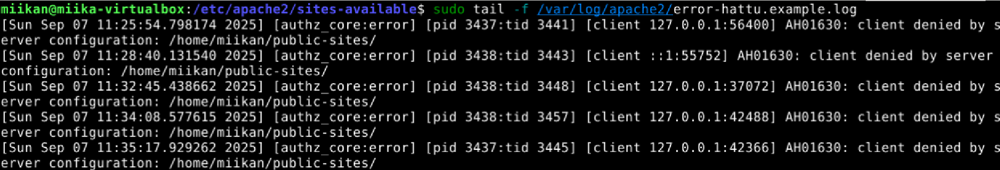

### Lue ja tiivistä
The Apache Software Foundation 2023: Apache HTTP Server Version 2.4 

- Name-based virtual host tarkoittaa, että samalla ip-voidaan hostata useita eri domaineja, mikä säästää ip-osoitteita.
- Jokaiselle hostille tehdään oma VirtualHost.
- Jokaiseen VirtualHostiin on määriteltävä ServerName, jotta Apache löytää oikean osoitteen.

Karvinen 2018: Name Based Virtual Hosts on Apache – Multiple Websites to Single IP Address

- Apachella voi hostata useita eri domainnimiä samassa ip-osoitteessa.
- Vanha etusivu poistetaan käytöstä ja luodaan uusi Name Based Virtual Host.
- HTML-tiedosto luodaan .conf -tiedostossa määritettyyn hakemistoon.

Tein harjoituksen 4 ja 7.9.2025 kotitoimistossani Kaarinassa. Koneena oli Lenovo V14 G4 AMN. Käyttöjärjestelmänä Windows 11 Pro version 23H2.
Harjoituksessa seurattiin Teron (Tero Karvinen, 8.8.2025) kurssisivun tehtäviä.

### Testaa localhost
Asensin Apachen keskiviikon luennon aikana.  
- 4.9.2025 19:03 Hain selaimella localhost, ja apachen default page avautui.

### Analysoi apachen lokit
- 19:35 Avasin access lokin komennolla  
__sudo tail -f /var/log/apache2/access.log__.

Kun päivitin nettisivun (localhost), niin lokille muodostui yksi uusi rivi, jonka sisältö oli seuraavanlainen:

- __127.0.0.1__ Ensimmäisenä rivillä näkyy ip-osoite, josta pyyntö lähetettiin. Tämän voi varmistaa komennolla __ip addr show__, joka palauttaa saman osoitteen.

- __- -__ Ensimmäinen viiva viittaa identd-palvelun palauttamaan, TCP-yhdteyden toisessa päässä olevan käyttäjän nimeen. Tämä on harvemmin käytössä tietoturvasyistä, joten siksi "-". Toinen viittaa atentikoituneeseen käyttäjänimeen, jos käyttäjä on kirjautunut HTTP-autentikoinnilla palvelimelle.(ChatGPT)

- __[04/Sep/2025:19:35:00 +0300]__ Aikaleima (Suomen ajassa) jolloin pyyntö tehtiin.

- __GET / HTTP/1.1__ HTTP-pyynnön tiedot. GET-pyyntö lähettää pyynnön back-endille sivun sisällöstä. HTTP/1.1 on käytetty protokolla.

- __200__ HTTP vastauskoodi "ok", eli onnistunut pyyntö.

- __313__ Vastauksen koko tavuina (Girvin 2025).

- __"Mozilla/5.0 (X11; Linux x86_64; rv:128.0) Gecko/20100101 Firefox/128.0"__ Pyynnön lähettäjän selaimen ja käyttöjärjestelmän tiedot (Girvin 2025)

Tarkistin myös error lokin komennolla __sudo tail -f /var/log/apache2/error.log__. Täällä ei ollut mitään mikä olisi viitannut sivun latautumiseen. Ainoastaan Apachen käynnistymiseen liittyviä tietoja. Sama homma kun tein komennon __sudo journalctl -f -u apache2__.

### Etusivu uusiksi
Etusivu uusiksi. Tee uusi name based virtual host. Sivun tulee näkyä suoraan palvelimen etusivulla http://localhost/. Sivua pitää pystyä muokkaamaan normaalina käyttäjänä, ilman sudoa. Tee uusi, laita vanhat pois päältä. Uusi sivu on hattu.example.com, ja tämän pitää näkyä: asetustiedoston nimessä, asetustiedoston ServerName-muuttujassa sekä etusivun sisällössä (esim title, h1 tai p).

Tämän tehtävän tekemiseen käytin Johanna Heinosen (2025) tekemää luentomateriaalia. Muihin lähteisiin viitataan tarvittaessa erikseen.

- 7.9.2025 9:42 Aloitin tarkistamalla oletus etusivun nimen sites-available -hakemistosta.
Tämän jälkeen poistin vanhan etusivun käytöstä komennolla __sudo a2dissite 000-default.conf__ ja latasin konfiguraatiot __sudo systemctl reload apache2__ -komennolla.

Jostain syystä curl sekä selain löysi edelleen vanhan kotisivun, mutta päätin jatkaa eteenpäin ja murehtia tästä myöhemmin.

- 9:55 Lisäsin /etc/hosts -tiedostoon alla näkyvät rivit:

-  10:15 Lisäsin hattu.example.com sivun konfiguraatiotiedoston sites-available -hakemistoon ja täytin sen alla näkyvällä tavalla:

- 10:35 Siirryin kotihakemistoni public-sites kansioon ja tässä kohtaa tajusin, että en voi käyttää sitä DocumentRootina, koska siellä on jo yksi html tiedosto jonka teimme keskiviikon tunnilla. Tein public-sites kansioon uuden hattu-nimisen kansion komennolla __mkdir -p hattu__ ja lisäsin sinne index.html -tiedoston komennolla micro index.html.

Kävin tarkistamassa että index.html:n koko hakemistorakenteen luvat on kunnossa, mutta niissä ei ollut muokattavaa.

- 11:20 Lopulta aktivoin konfiguraatiotiedoston käyttöön komennolla __sudo a2ensite hattu.example.com.conf__ ja latasin muutokset __sudo systemctl reload apache2__.

Kun ajoin komennon curl localhost, sain tämän virheilmoituksen:

Hatun error loki paljasti nopeasti ongelman syyn:

Server configuration näyttää hakemistoon /home/miikan/public-sites/, eli olin unohtanut lisätä hatun konfiguraatiotiedoston DocumentRootiin ja Directoryyn hattu-kansion, jonka olin tehnyt public-sites kansion sisään.

Tämä ei korjannut ongelmaa, joten kävin huolellisesti läpi kaikki tiedostot joita muokkasin, ja löysinkin /etc/hosts sekä hatun konfiguraatio-tiedostosta pari pientä typoa. Kun korjasin nämä, niin sain sivun näkymään.

### HTML5 sivu
En ole mikään HTML-expertti, koska käytän frontend-koodaamisessa aina reactia, joten kopioin netistä HTML5 pohjan (Lazaris 12.9.2023), johon tein bodyn sisällön, hieman CSS-tyylittelyä, sekä hieman JavaScriptiä.

Tässä lopputulos:

### Curl
Yksinkertaisin tapa käyttää curlia on antaa komento culr sekä haluamasi nettisivu, esim aiemmissa tehtävissä käyttämäni __curl localhost__.
Tämä vastaa selaimien view page source, eli se palauttaa koko sivun HTML:n.

curl -I on houmattavasti hyödyllisempi komento, sillä se näyttää monipuolisemmin tietoa HTTP vastauksen sisällöstä.
- Ylin kohta näyttää mitä protokollaa käytettiin sekä HTTP vastauskoodin.
- Date: Päivämäärä ja aika jolloin vastaus tuli palvelimelta.
- Server: Millä palvelimella sivu toimii.
- Last-Modified: Milloin sivua on viimeksi muokattu.

### Github education

### Lähteet
David Girvin. 20.2.2025. Understanding the Apache eccess log: how to view, locate, and analyze. Luettavissa: https://www.sumologic.com/blog/apache-access-log. Luettu: 4.9.2025.

Johanna Heinonen. 2025. Apache2. Luettavissa: https://github.com/johannaheinonen/johanna-test-repo/blob/main/linux-03092025.md. Luettu: 7.9.2025.

Louis Lazaris. 12.9.2023. The Complete HTML5 Boilerplate. Luettavissa: https://www.sitepoint.com/a-basic-html5-template/. Luettu: 7.9.2025.

Superuser. What is the difference between apt dist-upgrade and apt upgrade? Luettavissa: https://superuser.com/questions/1554163/what-is-the-difference-between-apt-dist-upgrade-and-apt-upgrade. Luettu: 7.9.2025.

Tero Karvinen. 8.8.2025. Linux Palvelimet 2025 alkusyksy. Luettavissa: https://terokarvinen.com/linux-palvelimet/. Luettu: 7.9.2025.