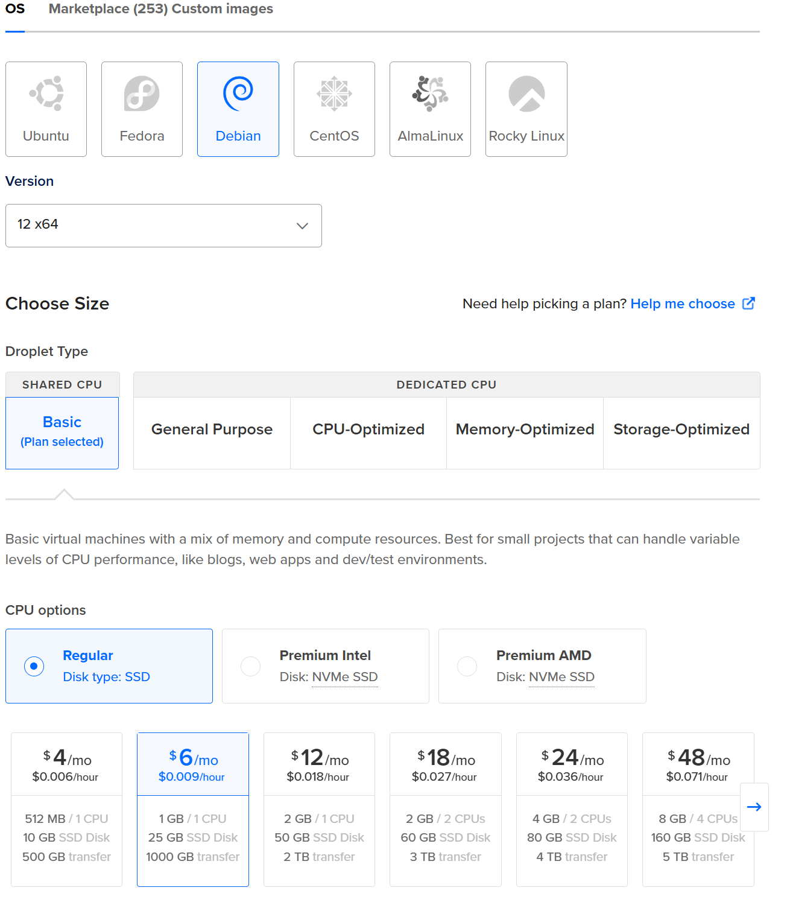
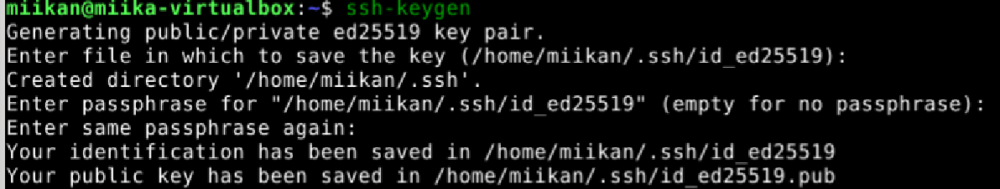
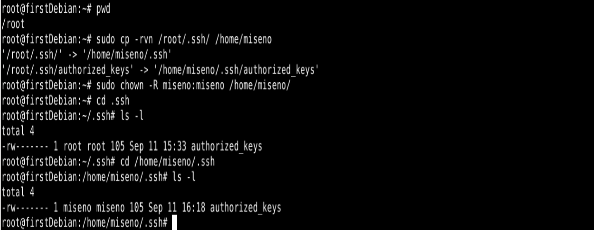
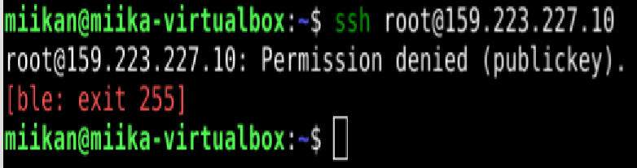

### Lue ja tiivistä
https://susannalehto.fi/2022/teoriasta-kaytantoon-pilvipalvelimen-avulla-h4/
- GitHub Education tarjoaa opiskelijalle mahdollisuuden vuokrata pilvipalvelimen ja domainnimen ilmaiseksi.
- DigitalOcean antaa käyttäjän luoda virtuaalikoneen vaivattomasti ja käyttäjä voi luoda maksuhälytyksiä, ettei luottokortilta veloiteta turhia summia.
- NameCheapista voi vuokrata domainnimen ja ohjata sen osoittamaan haluamalleen virtuaalipalvelimelle.

- DigitalOceanin virtuaalipalvelimelle voi asentaa ufw-palomuurin ottamalla siihen ssh-etäyhteyden.

- Kotisivut saa palvelimelle käyttämällä komentoa __sudo a2enmod usedir__, jolloin käyttäjä voi julkaista sivuja omasta hakemistostaan.

- __sudo apt-get upgrade__ päivittää pakettivarastojen tietokannan. __sudo apt-get upgrade__ asentaa kaikki saatavilla olevat päivitykset. __sudo apt-get dist-upgrade__ asentaa päivitykset ja poistaa tarvittaessa paketteja konfliktien välttämiseksi (Michlang 2.6.2020).

https://terokarvinen.com/2017/first-steps-on-a-new-virtual-private-server-an-example-on-digitalocean/
- Kun virtuaalipalvelin on pystyssä, on se syytä tehdä tietoturvalliseksi.
- Asenna palomuuri ja avaa portti 22/tcp, joka mahdollistaa ssh-yhteyden.
- Luo uusi käyttäjä itsellesi ja lukitse root-käyttäjä.
-Päivitä ohjelmistot estääksesi haavoittuvuuksia.

### Ympäristö
Tein harjoituksen 11.9.2025 kotitoimistossani Kaarinassa. Koneena oli Lenovo V14 G4 AMN. Käyttöjärjestelmänä Windows 11 Pro version 23H2.

### Vuokraa virtuaalipalvelin
17:57. Loin tilin DigitalOcean -palveluun GitHub -tunnuksieni avulla. Sain automaattisesti käytettäväksi 200 dollaria credittejä, jotka ovat voimassa vuoden verran, koska minulla on GitHub educations.

Valitsin Create a Droplet -> Palvelimeksi valitsin Datacenter 3 Amsterdamissa, koska se on lähimpänä Suomea -> Käyttöjärjestelmäksi valitsin uusimman saatavilla olevan Debianin (v. 12 x64) -> Valitsin jaetun 1 GB:n CPU:n, 25 GB muistia ja 1000 GB datansiirtoa. Kokonaishinnaksi tuli 6€/kk.

18:18. Päätin kokeilla ssh-avaimen generoimista. Päivitin pakettikirjaston __sudo apt-get update__, asensin ssh clientin __sudo apt-get -y install openssh-client__ ja loin uuden avaimen __ssh-keygen__.

Kopioin julkisen avaimen hakemistostani microlla, ja liitin sen DigitalOceanin New SSH Key -kenttään. Lopulta annoin vielä kuvaavan Hostnamen ja painoin Create Droplet.

### Palvelimen alkutoimet
18:45. Kirjauduin virtuaalikoneelle ssh-yhteydellä __ssh root@159.223.227.10__. Lisäsin itselleni uuden käyttäjän __sudo adduser miseno__ ja tein siitä sudo-käyttäjän __sudo adduser miseno sudo__.

19:00. Latasin palomuurin __sudo apt-get -y install ufw__, avasin portin 22 __sudo ufw allow 22/tcp__ ja kytkin palomuurin päälle __sudo ufw enable__.

19:15. Seuraavaksi kopioin ssh-asetukset omaan kotihakemistooni komennolla __sudo cp -rvn /root/.ssh/ /home/miseno/__, sekä vaihdoin ssh-kansion siällön omistajan omalle käyttäjälleni komennolla __sudo chow -R miseno:miseno /home/miseno/__.
Lopulta kävin vielä tarkistamassa oman hakemistoni .ssh-kansiossa, että kaikki on kunnossa:

19:30. Tässä kohtaa muistin tarkistaa että voinhan kirjutua omalla käyttäjälläni, joten avasin uuden terminaalin ja annoin komennon __ssh miseno@159.223.227.10__. Pääsin sisään! Kirjauduin ulos rootina komennolla __exit__.

19:45. Seuraavaksi oli tarkoitus estää rootilla kirjautuminen. Ajoin komennon __sudo usermod --lock root__, joka estää salasanalla kirjautumisen. Tämän jälkeen estin vielä ssh-avaimella kirjautumisen komennolla __sudo mv -nv /root/.ssh /root/DISABLED-ssh__. Tämä siirtää .ssh-kansion DISABLED-ssh -nimiseen kansioon, jolloin rootilla ei ole enää käytössä omia SSH-avaimia. Löysin Teron tekemistä vanhemmista ohjeista toisenkin tavan; muokkaamalla sshd_config -tiedostoa, joten kävin varmuuden vuoksi laittamassa sieltä __PermitRootLogin no__. Sitten ajoin __sudo systemctl restart ssh__, jonka jälkeen avasin toisen paikallisen terminaalin ja koitin kirjautua rootina sisään, jolloin vastaukseksi tuli odotusten mukaisesti Permission denied (publickey).
.

Lopulta asensin vielä muutaman hyödyllisen ohjelman komennolla __sudo apt-get -y install micro bash-completion openssh-client wget curl__, latasin viimeisimmät päivitykset __sudo apt-get upgrade__ sekä boottasin koneen __sudo systemctl reboot__. Kokeilin vielä että pääsen varmasti kirjautumaan takaisin, kun kone oli käynnistynyt uudestaan.
