### Ympäristö
Tein harjoituksen 20 ja 22.9.2025 kotitoimistossani Kaarinassa. Koneena oli Lenovo V14 G4 AMN. Käyttöjärjestelmänä Windows 11 Pro version 23H2.

### Nimi
18:15 Aloitin vuokraamalla Namecheapiltä oman domainnimen. Päätin olla käyttämätt GitHub educationsin alennusta, koska se koski ainoastaan .me -suffixeja. Rekisteröidyin palvelussa käyttäjäksi, laitoin kaksivaiheisen tunnistautumisen päälle, ja syötin maksutiedot.

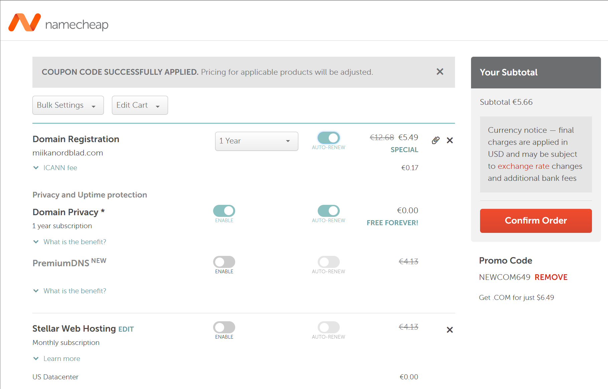

18:40 Seuraavaksi laitoin vielä domainnimeni osoittamaan virtuaalipalvelimelleni. Seuraamalla ohjeita (Lehto. 14.2.2022), menin Namecheapin sivuilla Dashboard -> vuokratun domainin kohdalta Manage -> Advanced DNS. Poistin Host Recordsista Redirect Recordin ja lisäsin kaksi A Recordia alla olevan kuvan mukaisesti:

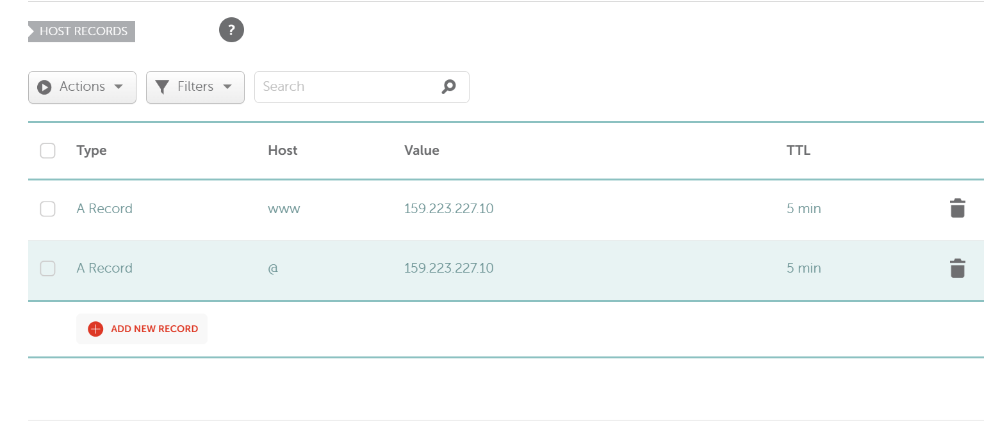

Tein viime viikolla ylimääräisen tehtävän, jossa virtuaalipalvelimelle lisättiin uusi name based virtual host. Nyt kun kirjoitin selaimeen miikanordblad.com, niin tämä kyseinen NBVH tuli näkyviin.

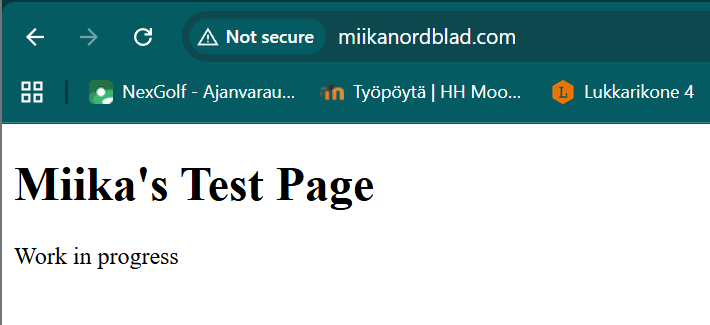

20:00 Lopuksi kävin vielä tekemässä muutoksia viime viikon vaapaaehtoiseen tehtävään.

Muutin NBVH:n .conf -tiedoston nimen.
````
$ cd /etc/apache2/sites-available/ 
$ sudo mv miikanordblad.me.conf miikanordblad.com.conf
````
Kävin tietenkin myös vaihtamassa tiedoston sisällön:

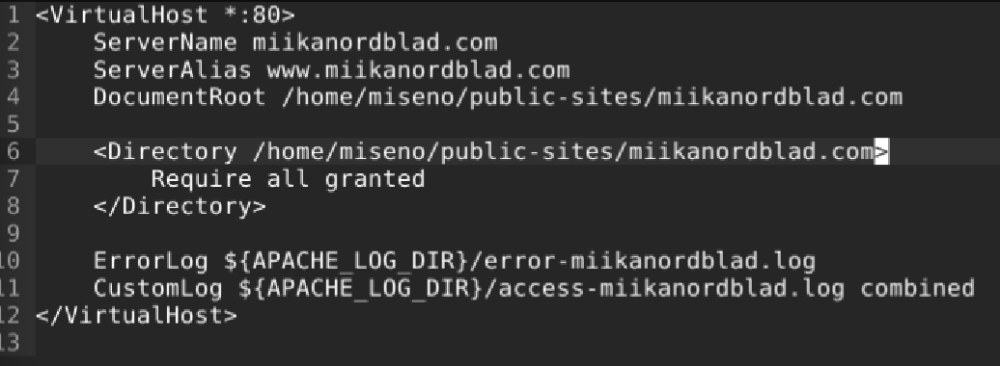

Sitten vaihdoin kansion nimen missä html-tiedosto on:

```
$ mv public-sites/miikanordblad.me public-sites/miikanordblad.com
```
Lopulta ajoin vielä komennot:
```
$ sudo a2ensite miikanordblad.com
$ sudo systemctl reload apache2
```
Tarkistin tietysti vielä että sivu latautuu selaimeen.

### Alidomain
20:05. Menin namecheapin sivuilla takaisin Advanced DNS -kohtaan. Seurasin namecheapin sivuilta löytämääni ohjetta (namecheap.com). Tiukan aikataulun takia päätin olla tekemättä vapaaehtoisia lisätehtäviä, joten laitoin alidoimainit osoittamaan virtuaalipalvelimen ip-osoitteelle. Tein kaksi uutta a-recordsia. Toisella annoin hostiksi blog ja toiselle shop.

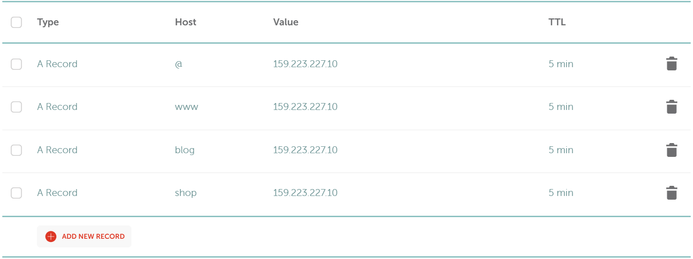

Sitten kävin vielä tarkistamassa että alidomainit toimivat selaimessa:

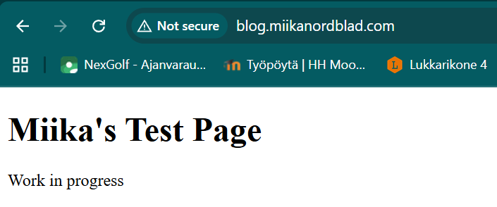
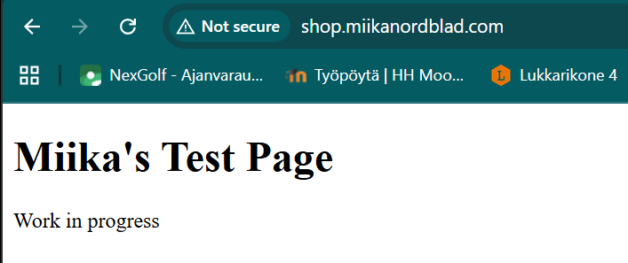

### DNS-tietojen tutkiminen
20:30
Aloitin asentamalla dig ja host ohjelmat.

```
$ sudo apt-get update
$ sudo apt-get -y install dnsutils bind9-host
```

21:04 
Sitten ajoin komennon `dig miikanordblad.com`.
Tulosten tulkitsemiseen käytin netistä löytämääni blogipostausta (blog.globalping.io. 17.11.2023).

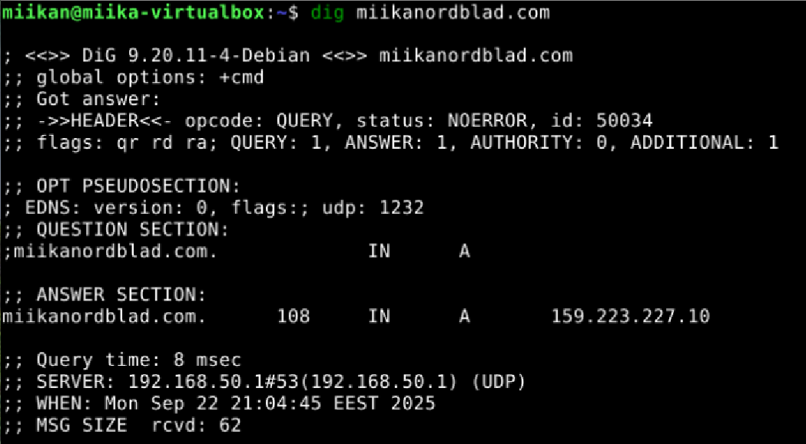

Komennon output kertoo, että kysely onnistui ja tuloksena löytyi yksi A-tietue osoitteesta 159.223.227.10, joka on virtuaalipalvelimeni ip-osoite.
Domain-nimen jälkeen tuleva luku (108) on TTL (Time To Live), joka kertoo kuinka kauan DNS-tietue saa elää välimuistissa ennen kuin se täytyy hakea uudelleen nimipalvelimelta.

Lopussa kerrotaan vielä mille palvelimelle ja portille dns-kysely tehtiin, sekä sen aikaleima.

Host vastaus antoi vaan saman ip-osoitteen sekä sähköpostipalvelimien tietoja.

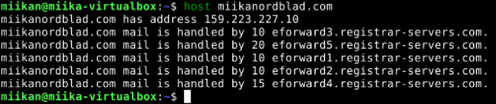

Seuraavaksi tein dns-kyselyn yritykseni osoitteeseen:

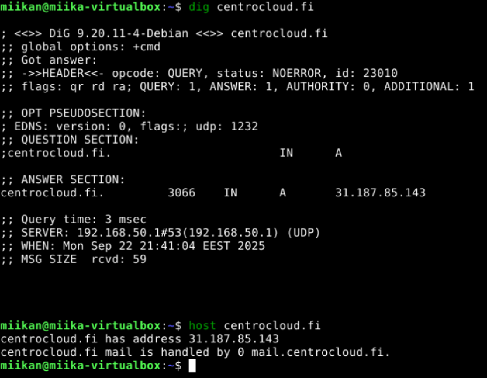

Silmillepistävänä erona miikanordblad.comiin oli TTL:n pituus joka oli yli 50 minuuttia.

host komento paljasti myös, että sähköpostiliikenne on ohjattu alidomainille mail.centrocloud.fi.

Tein dns-kyselyn myös Youtubelle:
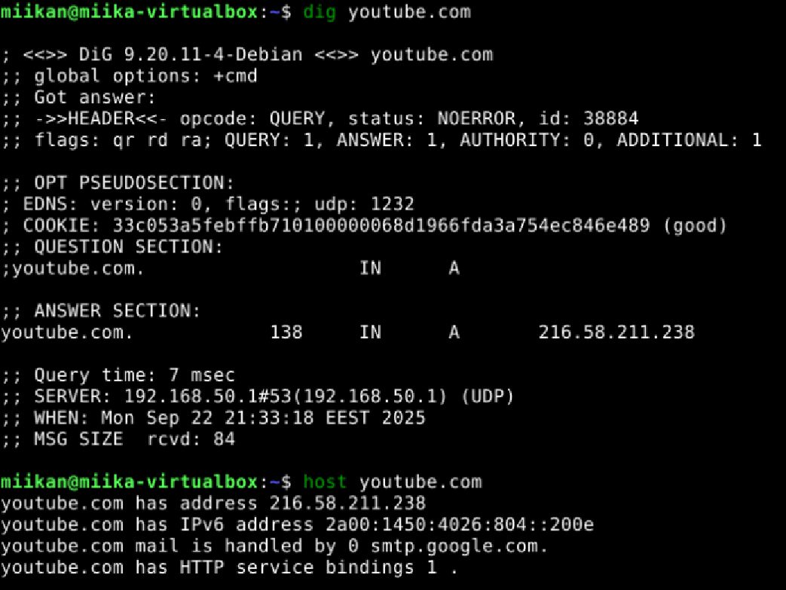

Youtuben TTL oli lyhyt, se hoitaa oman mail-liikenteen googlen alidomainin avulla ja sillä on myös IPv6-tuki.

### Lähteet
blog.globalping.io. 17.11.2023. How to Read a Dig Result: A Guide for Network Novices. Luettavissa: https://blog.globalping.io/how-to-read-a-dig-result-a-guide-for-network-novices/. Luettu: 22.9.2025.

namecheap.com. How to Create a Subdomain for my Domain. Luettavissa: https://www.namecheap.com/support/knowledgebase/article.aspx/9776/2237/how-to-create-a-subdomain-for-my-domain/. Luettu: 22.9.2025.

Susanna Lehto. 14.2.2022. Teoriasta käytäntöön pilvipalveluiden avulla (h4). Luettavissa: https://susannalehto.fi/2022/teoriasta-kaytantoon-pilvipalvelimen-avulla-h4/. Luettu: 20.9.2025.