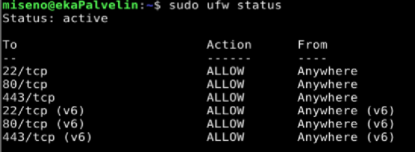
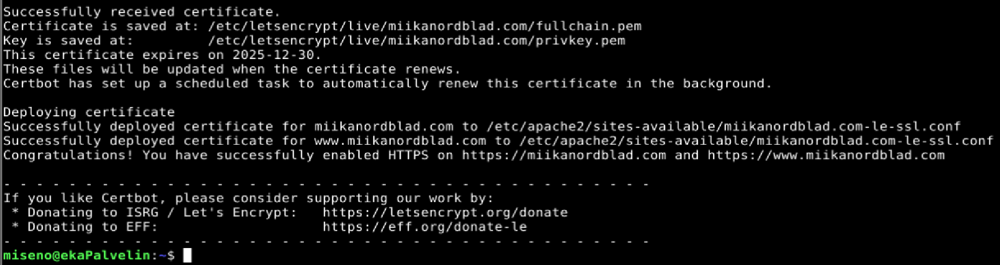
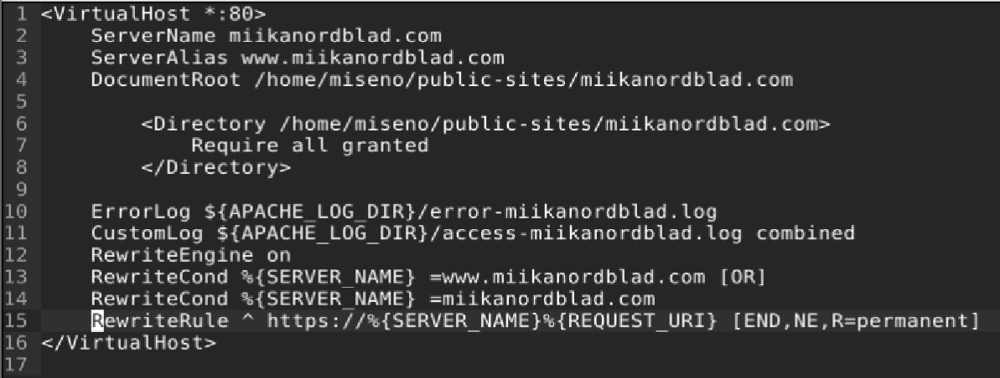
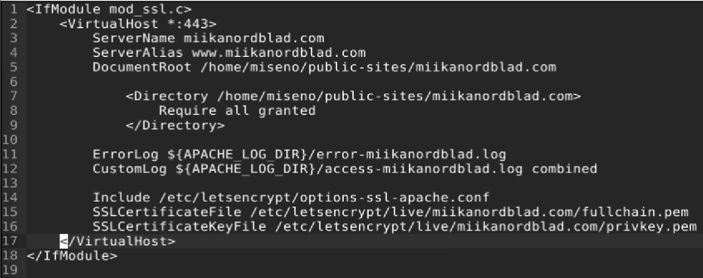
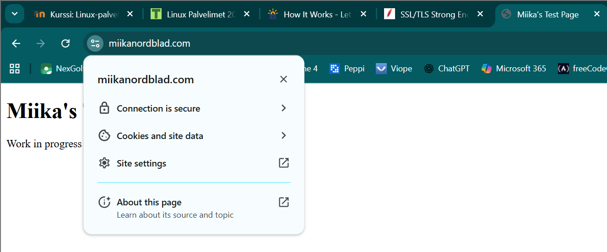
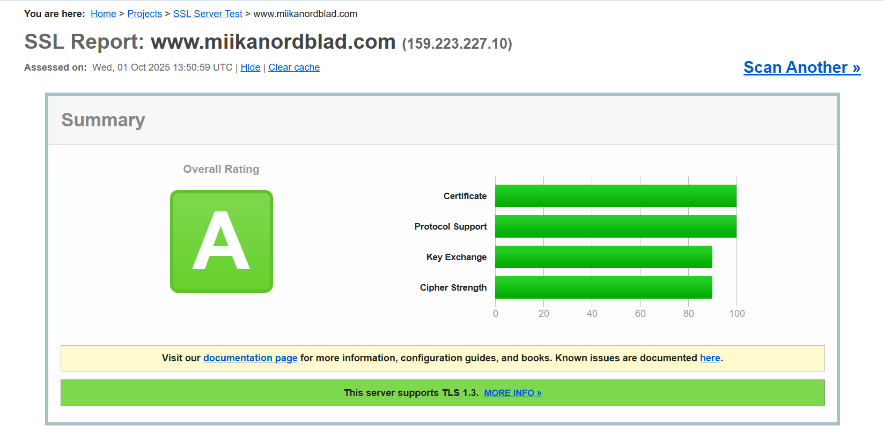

### Lue ja tiivistä
https://letsencrypt.org/how-it-works/

- Let's Encrypt käyttää ACME-protokollaa kommunikoidakseen palvelimen kanssa.
- Domainin hallinta todistetaan tekemällä Let’s Encryptin antama haaste (DNS- tai HTTP-tietue).
- Hyväksytyn haasteen jälkeen Let’s Encrypt myöntää SSL/TLS-sertifikaatin domainille.
- Sertifikaatti uusitaan toistamalla sama prosessi (haaste + uusi pyyntö).
- Sertifikaatti voidaan mitätöidä, jolloin selaimet saavat tiedon ettei sitä pidä enää käyttää.

https://httpd.apache.org/docs/2.4/ssl/ssl_howto.html#configexample

- Apachelle pitää ottaa käyttöön SSL-moduuli, kuunnella porttia 443 ja määrittää VirtualHost, jossa on SSLEngine on sekä polut sertifikaatille ja avaimelle.
- Palvelin voi lähettää selaimille valmiin tiedon sertifikaatin voimassaolosta -> nopeampaa ja yksityisempää kuin jos selain kysyisi tiedon suoraan varmentajalta.
- Apache voidaan konfiguroida vaatimaan käyttäjiltä asiakasvarmenne (client certificate) koko sivustolla tai vain tietyssä hakemistossa/URL-osoitteessa.
- SSL-asetuksia voi yhdistää IP-suodatukseen ja HTTP Basic Authiin, esim. sallia eri tason pääsy sisäverkon ja internetin käyttäjille.
- mod_ssl osaa tuottaa yksityiskohtaista lokitietoa, ja LogLevel-arvoa voi säätää tarpeen mukaan (debug-taso = hyvin yksityiskohtainen, info-taso = perus).

### Hanki TLS-sertifikaatti
Tein harjoituksen 1.10.2025 kotitoimistossani Kaarinassa. Koneena oli Lenovo V14 G4 AMN. Käyttöjärjestelmänä Windows 11 Pro version 23H2.

Viikon tehtävä oli melko yksinkertainen ja onnistuin sen tekemisessä Teron kurssisivuille laatimien vinkkien avulla (terokarvinen.com).

16:00. Aloitin potkaisemalla apachea komennolla `$ sudo systemctl restart apache2`. Seuraavaksi tarkistin, että miikanordblad.com näkyy windows koneeni sekä puhelimeni selaimessa.

16:05. Avasin palomuurista HTTPS-portin komennolla `$ sudo ufw allow 443/tcp`. Tarkistin että kaikki on kunnossa:

.

16:10. Seuraavaksi latasin asensin certbotin ja loin sertifikaatin domain-nimelleni:
```
$ sudo apt-get update
$ sudo apt-get -y install certbot python3-certbot-apache
$ sudo certbot --apache --domains miikanordblad.com,www.miikanordblad.com
```
Syötin sähköpostini kenttään kun sitä kysyttiin, hyväksyin käyttöehdot ja en antanut lupaa lähettää sähköpostiini spämmiä. Lopulta tuli ilmoitus, että sertifikaatti luotiin onnistuneesti:



Kävin vielä tarkistamassa apachen sites-available -kansiosta että le-ssl -tiedosto oli luotu ja että alkuperäiseen conf-tiedostoon oli tehty tarvittavat lisäykset. Korjasin myös tiedostojen sisennykset:




16:40. Lopulta ajoin `$ sudo systemctl restart apache2`. Avasin windows-koneellani selaimen ja päivitin miikanordblad.com -sivun, ja ilokseni huomasin, että yhteys oli salattu.




### A-rating

16:50. Testasin sivuani SSL Labsin kanssa, ja ilmeisesti kuulun nyt parhaaseen a-luokkaan:



### Lähteet
terokarvinen.com. Linux Palvelimet 2025 alkusyksy. h6 Salataampa. Luettavissa: https://terokarvinen.com/linux-palvelimet/. Luettu: 1.10.2025.