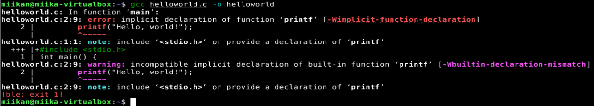

# Maalisuora
Tein harjoituksen 1.10.2025 kotitoimistossani Kaarinassa. Koneena oli Lenovo V14 G4 AMN. Käyttöjärjestelmänä Windows 11 Pro version 23H2.

### Hei maailma

#### Shell Script
23:40.  Seurasin Johannan tekemiä ohjeita (Johanna Heinonen, 1.10.2025), sekä Teron tehtävänantoa (Tero Karvinen, 8.8.2025). Tein ensin shell scriptin. Aloitin luomalla tiedoston komennolla `$ micro helloworld.sh`.
Lisäsin tiedostoon rivin:
```
echo "Hello, world!"
```
Sitten kävin muokkaamassa tiedoston luvat kuntoon komennolla `$ chmod a+x helloworld.sh`. Tämä tekee tiedostosta ajettavan ohjelman.

Lopulta ajoin scriptin:


#### Python
23:55. Aloitin tarkistamalla Python3:n version komennolla `$ python3 --version`. Johannan vinkistä latasin ohjelman joka antaa ajaa Python3 ohjelmat komennolla python:
```
$ sudo apt-get update
$ sudo apt-get upgrade
$ sudo apt-get install python-is-python3
```
Seuraavaksi loin tiedoston ja lisäsin sinne pyton scriptin, sekä annoin ajo-oikeudet:
```
$ micro helloworld.py
print("Hello, world!")
$ chmod a+x helloworld.py
```
Lopulta ajoin ohjelman:


#### C
0:30. Latasin compilerin: `$ sudo apt-get install build-essential`.

Loin scriptin, käänsin ohjelman:
```
$ micro helloworld.c

int main() {
    printf("Hello, world!");
    return 0;
}

$ gcc helloworld.c -o helloworld
```
Tämä aiheutti virheilmoituksen:

Errorissa kehoitettiin lisäämään <stdio.h> tiedostoon, ja kun katsoin johannan ohjeita, niin hän oli myös tehnyt näin. Oletin että kyseessä oli vaan jokin kommentti, mitä ei ollut pakko sisällyttää.

Kävin tekemässä muutokset tiedostoon ja koitin uudelleen kääntämistä. Nyt onnistui:
```
$ micro helloworld.c

#include <stdio.h>

$ gcc helloworld.c -o helloworld
```
Lopuksi ajoin ohjelman:


### Laita Linuxiin uusi, itse tekemäsi komento niin, että kaikki käyttäjät voivat ajaa sitä.
0:53. Päätin tehdä hieman muunnellun version Johannan tekemästä ohjelmasta, joka lataa listan päivityksistä. Koska olin jo vanhasta tottumuksesta asentanut päivitykset virtuaalikoneelleni, niin päätin tehdä ohjelman DigitalOceanissa olevaan palvelimeeni.

Otin etäyhteyden `$ ssh miseno@159.223.227.10`.

Loin tiedoston komennolla `$ micro update.sh`


Annoin ajo-oikeudet `chmod a+x update.sh` ja ajoin ohjelman:


Harmikseni jouduin toteamaan että palvelimella ei ollut päivityksiä odottamassa. Tarkistin tämän vielä ajamalla `$ sudo apt-get upgrade` erikseen:
.

### Ratkaise vanha arvioitava laboratorioharjoitus soveltuvin osin.
1:37. Päätin automatisoida VirtualHostin tekemisen scriptillä.
Loin scriptin ja annoin sille ajo-oikeudet:

```
$ micro create_vhost.sh
$ chmod a+x create_vhost.sh
```
Tiedoston sisältö:


Testasin, että scripti toimii, ja sehän toimi:

Ainoa miinus oli, että a2ensite-komennon outputti tulostui nyt turhaan, koska `sudo systemctl reload apache2` ajetaan jo scriptissä. Tähän löytyi onneksi hyvä vinkki googlettamalla (StackOverflow, 5.8.2013).

Lopuksi lisäsin domainin localhostiksi komennolla `$ sudoedit /etc/hosts`, ja testasin curlilla että scripti toimii:


### Lähteet
Johanna Heinonen. 1.10.2025. Linux Shell Scripting Basics. Luettavissa: https://github.com/johannaheinonen/johanna-test-repo/blob/main/linux-01102025.md. Luettu: 6.1.2025.

StackOverflow. 5.8.2013. How to hide command output in Bash. Luettavissa: https://stackoverflow.com/questions/18062778/how-to-hide-command-output-in-bash. Luettu: 7.10.2025.

Tero Karvinen. 8.8.2025. Linux Palvelimet 2025 alkusyksy. Luettavissa: https://terokarvinen.com/linux-palvelimet/. Luettu: 6.1.2025.